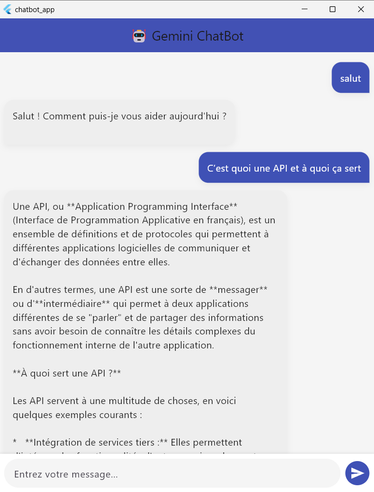

# 🤖 ChatBot Gemini Flutter App

Une application de chatbot développée avec **Flutter** utilisant l’API **Google Gemini (Generative AI)**. Ce projet vous permet de discuter en temps réel avec une IA dans une interface moderne et responsive.

---

## 📸 Démo



> *Interface simple, propre et interactive, intégrée avec l'API Gemini de Google.*

---

## ✨ Fonctionnalités

- 💬 Envoi et réception de messages avec Google AI Gemini.
- 🎨 Interface élégante (bulles de chat, couleurs modernes).
- ⏳ Loader animé avec [Flutter Spinkit](https://pub.dev/packages/flutter_spinkit).
- 📱 Responsive pour mobile et tablette.
- 🌐 Communication HTTP avec gestion d’erreurs.

---

## 🛠️ Technologies utilisées

- **Flutter** 3.x
- **Dart**
- **HTTP**
- **Google Gemini API**
- **flutter_dotenv** (pour stocker la clé API)
- **flutter_spinkit** (animations de chargement)

---

## 🧪 Configuration requise

- Flutter SDK ≥ 3.8.1
- Un compte Google AI Studio pour récupérer une **clé API Gemini**
- Android Studio, VS Code ou tout éditeur Flutter

---

## 🚀 Installation et exécution

1. **Clonez le projet** :

```bash
git clone https://github.com/AyoubdDev/chat_app.git
cd chat_app
Ajoutez votre clé API dans un fichier .env :

env
Copier
Modifier
GOOGLE_API_KEY=VOTRE_CLE_API_ICI
Installez les dépendances :

bash
Copier
Modifier
flutter pub get
Lancez l'application :

bash
Copier
Modifier
flutter run
📂 Arborescence du projet
bash
Copier
Modifier
chatbot_gemini_flutter/
├── lib/
│   ├── main.dart
│   └── chat_screen.dart
├── .env
├── pubspec.yaml
└── README.md
👨‍🏫 À propos
Projet Flutter réalisé dans le cadre de l'apprentissage du développement mobile avec intégration d'API d'intelligence artificielle.

Développé par :Ayoub Hilali
Année : 2025